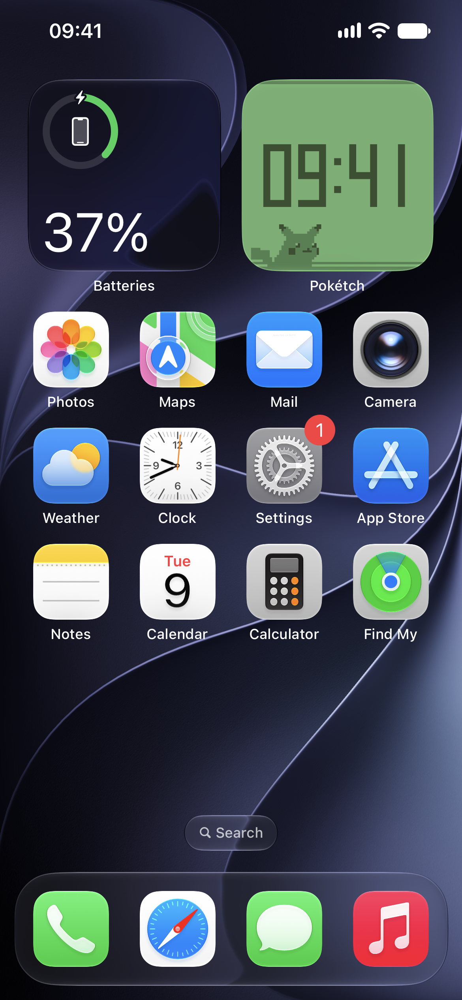
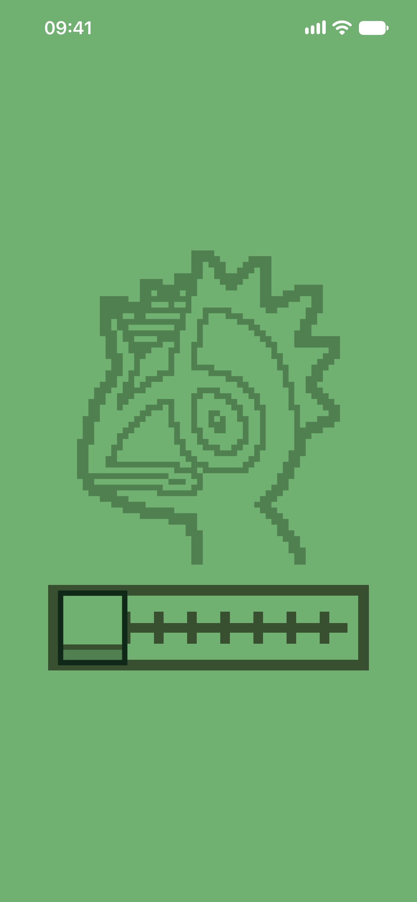
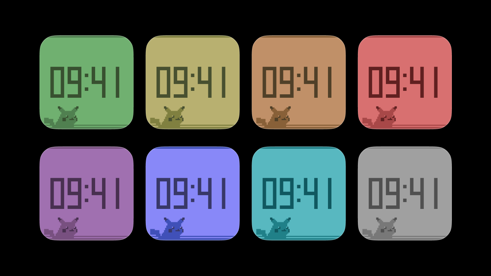

# Pokétch iOS Widget

## Description
Pokétch is a simple iOS widget recreating the Pokétch Clock from Pokémon Diamond, Pearl and Platinum, built entirely with SwiftUI.

  

## Features
- **Sizes** — Two square sizes; small and large.
- **Themes** — 8 different themes, just like in the game. Change the current theme in the app. The widget also supports Clear and Tinted modes.
- **Tap-to-glow** — Tap Pikachu to make the widget glow! The glow stays on to add more customization and color variations.

## Important Notes
Pokémon, Pokétch, Pikachu, and related assets are owned by Nintendo, Creatures Inc., and GAME FREAK inc.

This is an unofficial fan project and is not affiliated with or endorsed by them. The license for this project applies only to the original source code and not to Pokémon-related names, trademarks, characters, or assets.

This project is not intended for distribution on the App Store.

More of my work: [pascaljesenberger.com](https://pascaljesenberger.com/)
